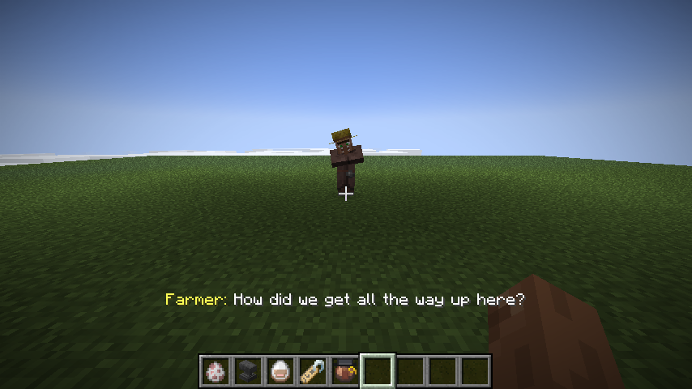
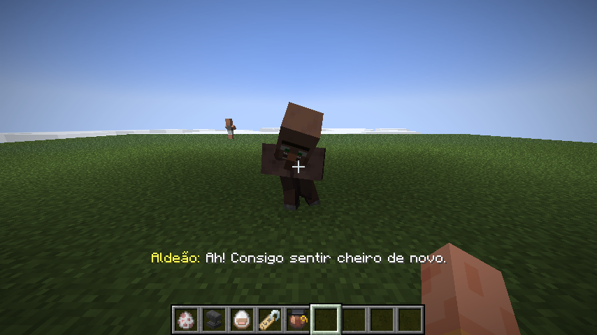
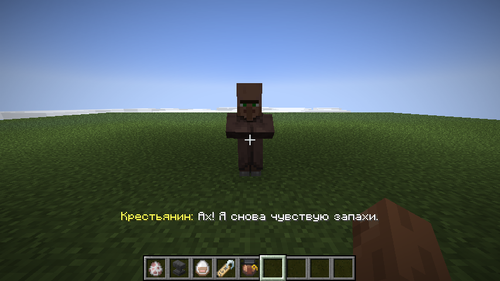
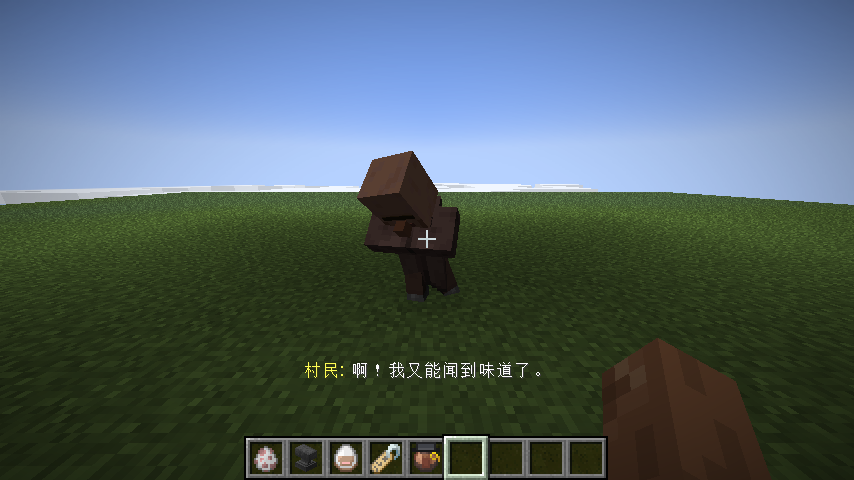
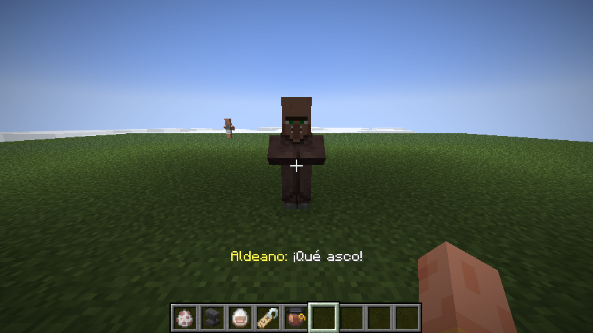
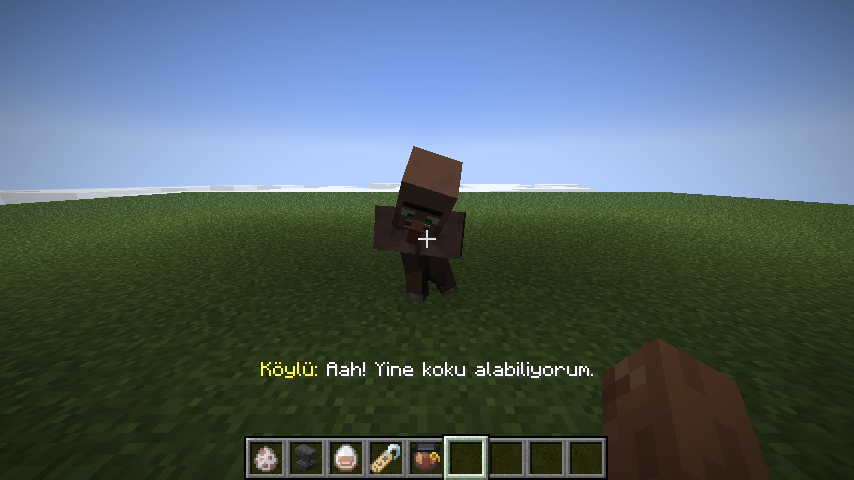
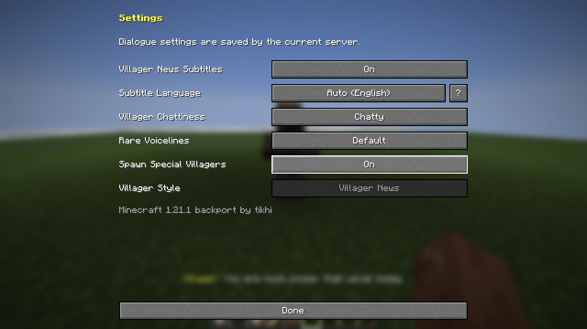
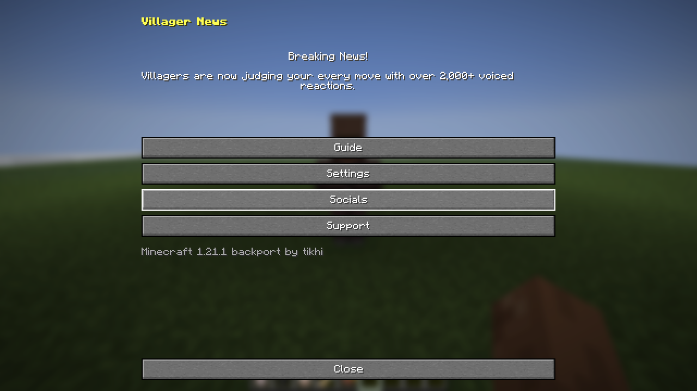

# Villager News Addon Java Backport

A Fabric backport of the **Villager News Addon Port** to **Minecraft Java Edition
1.21.1**. Current release: **1.3.6.1+1.21.1**. See [`CHANGELOG.md`](CHANGELOG.md)
for what changed.

This project is based on
[marcy's Villager News Addon Port](https://github.com/MarcYohannTheScripter/villager-news-bedrock-addon-java-port),
which brought the Villager News Bedrock add-on to Java Edition 26.3. That port
and all of its content are marcy's work. This backport makes it run on 1.21.1,
fixes a few bugs, and adds translations.

The original Villager News add-on, characters, models, textures, animations,
and voice acting were created by **Oreville Studios Ltd** and
**Element Animation**.



## Community

Join the [Villager News Addon Port Discord server](https://discord.gg/vEpbtj2ChP)
for support, updates, and discussion about the port.

## What this backport adds

- Runs on Minecraft 1.21.1 with Fabric Loader 0.19.5
- A subtitle language setting. **Auto** (the default) follows your game
  language, then another region of the same language, then English
- Subtitles, the handbook, the settings screen, and item names translated into
  Brazilian Portuguese, Russian, Simplified Chinese, Spanish, and Turkish
- Speaker names in front of subtitles, such as Farmer or Wandering Trader, and
  the text on the signs villagers carry use the subtitle language
- Anyone can add a new subtitle language by dropping a file into
  `config/villager-news-addon-port/subtitles`, like subtitle files for a movie.
  The settings screen explains how and opens the folder
- Automated in-game server tests (`runGametest`)

> **Note:** Only text can be translated. There is no support for translated
> voice acting. Every character still speaks the original English voice lines.

## What this backport fixes

- Wooly the Sheep no longer turns invisible
- Baby villagers use the correct baby model and size
- Renaming a villager `jeb_` now gives babies and special characters the
  rainbow nose too
- Special characters now really spawn in newly generated villages
- Morning, afternoon, evening, and night greetings now happen at the right time
  of day
- Villagers holding signs show the correct wood texture
- The Villager News Handbook looks right when held in the hand

## Screenshots

| English | Portuguese (Brazil) | Russian |
| --- | --- | --- |
|  |  |  |

| Simplified Chinese | Spanish (Spain) | Turkish |
| --- | --- | --- |
|  |  |  |

| Settings | Handbook |
| --- | --- |
|  |  |

## Required mods

| Mod | Version |
| --- | --- |
| [Fabric Loader](https://fabricmc.net/use/) | 0.19.5 or newer |
| [Fabric API](https://modrinth.com/mod/fabric-api) | for Minecraft 1.21.1 |
| [Entity Model Features (EMF)](https://modrinth.com/mod/entity-model-features) | 3.3.9 or newer, 1.21 build |
| [Entity Texture Features (ETF)](https://modrinth.com/mod/entitytexturefeatures) | 7.2.4 or newer, 1.21 build |
| [Entity Sound Features (ESF)](https://modrinth.com/mod/entity-sound-features) | 0.8.2 or newer, 1.21 build |
| [Mod Menu](https://modrinth.com/mod/modmenu) | optional |

You also need Java 21 or newer. Mod Menu's Configure button opens
the Villager News settings. Without it, the settings are in the Villager News
Handbook.

## Installation

1. Install Fabric Loader for Minecraft 1.21.1.
2. Put Fabric API, EMF, ETF, ESF, and
   `villager-news-addon-java-backport-1.3.6.1+1.21.1.jar` in the `mods` folder.
3. Start Minecraft with the Fabric profile.

For multiplayer, install the mod and its dependencies on the server and on
every client.

## Characters

Use a name tag on a villager:

| Name tag | Character |
| --- | --- |
| `Mayor`, `Mayor Villager`, or `The Mayor` | Mayor Villager |
| `Testificate Man` | Testificate Man |
| `Villager Number 5` or `Villager #5` | Villager Number 5 |
| `Villager Number 9` or `Villager #9` | Villager Number 9 |
| `Villager Unreachable` or `Can't Catch Me!` | Villager Unreachable |

Name a sheep `Wooly` or `Wooly The Sheep` to turn it into Wooly. Ordinary
villagers and wandering traders get their Villager News look and dialogue
automatically. Special characters can also appear in new villages far from
spawn.

Craft the Villager News Handbook from three pieces of paper. Shear an adult
villager to take its nose, and give it back by using the nose on that villager.

## Languages

The handbook, settings screen, and item names follow your Minecraft language.
Subtitles follow the **Subtitle Language** setting. Open the Villager News
settings and click it to switch between **Auto** and the installed languages.
Click **?** next to it for the in-game translation guide.

**Auto** uses your game language. If there are no subtitles for it, another
region of the same language is used (for example Mexican Spanish uses Spanish
subtitles), and English otherwise.

| Language | Voice acting | Subtitles | Handbook, settings, and items |
| --- | --- | --- | --- |
| English | yes | yes | yes |
| Portuguese, Brazil (Português do Brasil) | no | yes | yes |
| Russian (Русский) | no | yes | yes |
| Simplified Chinese (简体中文) | no | yes | yes |
| Spanish, Spain (Español de España) | no | yes | yes |
| Turkish (Türkçe) | no | yes | yes |

### Adding a subtitle language

Subtitle files work like subtitle files for a movie. You do not need a resource
pack. The first time the game starts, the mod puts every language it ships in
this folder:

```
.minecraft/config/villager-news-addon-port/subtitles/
├── en_us.json                 English, copy this one to start a new language
├── es_es.json                 Spanish (Spain)
├── pt_br.json                 Portuguese (Brazil)
├── ru_ru.json                 Russian
├── tr_tr.json                 Turkish
├── zh_cn.json                 Simplified Chinese
├── example_language.json      a short example of the format
└── ai_translation_prompt.md   optional prompt for AI assistants
```

1. In the Villager News settings, click **?** next to Subtitle Language, then
   **Open subtitles folder**.
2. Copy `en_us.json` and name the copy after a Minecraft language code, such as
   `de_de.json`, `fr_fr.json`, or `it_it.json`.
3. Set `"language"` to the name of your language, for example `"Deutsch"`.
   This name is shown in the settings.
4. Translate every line in `"subtitles"`. Do not change the keys on the left.
   Lines with the same number before the last dot are parts of one voice line
   and are shown one after another. Keep the tone, the shouting in CAPITALS,
   and stretched words such as `Aaagh` or `Nooo`.
5. Translate the speaker names in `"names"`, such as Farmer or Wandering
   Trader. You can use the names from Minecraft's own language file.
   `"signs"` holds the text on the signs villagers carry. `\n` starts a new
   line, and long text shrinks to fit the sign.
6. Open the settings again and pick your language, or leave it on **Auto** if
   it matches your game language. No restart is needed.

Any line you leave out is shown in English.

You can edit any of the files, including the ones the mod ships, and your
changes are kept. Delete a file to remove its language. English always stays
as the fallback. Files you have not changed are updated when the mod updates.
To bring back a language you deleted, delete
`config/villager-news-addon-port/subtitles_state.json`.

Resource packs still work too. A pack can add subtitles at
`assets/villager-news-addon-port/subtitles/<code>.json`, which is useful for
servers that send a resource pack to every player.

**Optional, with AI:** `ai_translation_prompt.md` in the same folder is a
ready-made prompt for AI coding assistants. Open this project in one, give it
the prompt, and it drafts a complete subtitle file that keeps the tone,
shouting, and stretched words. Have a native speaker check the result.

### Translating the handbook and items

The handbook, settings screen, and item names use a normal Minecraft language
file. Copy `assets/villager-news-addon-port/lang/en_us.json` from the mod jar
into your resource pack as `assets/villager-news-addon-port/lang/<code>.json`
and translate the values. Keep `%s` where it appears, and keep the line breaks
inside the handbook text.

If you want your language included in the mod, open a pull request that adds
your files to `src/main/resources/assets/villager-news-addon-port/subtitles`
and `src/main/resources/assets/villager-news-addon-port/lang`.

## Building

You need JDK 21 or newer.

```bash
./gradlew build
```

On Windows use `gradlew.bat build`. The jar is written to
`build/libs/villager-news-addon-java-backport-<version>.jar`.

Every push to GitHub is built and tested automatically, and the jar can be
downloaded from the run's artifacts. Pushing a tag that starts with `v`, such
as `v1.3.6+1.21.1`, also publishes a GitHub release with the jar and the
changelog.

### Building for another 1.21.x version

All version numbers are in `gradle.properties`:

| Property | What to set |
| --- | --- |
| `minecraft_version` | the Minecraft version, for example `1.21` |
| `fabric_api_version` | the matching Fabric API version from [Fabric's develop page](https://fabricmc.net/develop/) |
| `emf_version`, `etf_version`, `esf_version` | Modrinth version IDs of the EMF, ETF, and ESF builds for that Minecraft version |
| `modmenu_version` | the matching Mod Menu version |
| `version` | the mod version, for example `1.3.6+1.21` |

The Modrinth version ID is the short code at the end of a version page URL,
for example `FMPLuEEv` in `modrinth.com/mod/entity-model-features/version/FMPLuEEv`.
The `minecraft` dependency in `fabric.mod.json` is filled in from
`minecraft_version` automatically.

Minecraft 1.21 and 1.21.1 share the same code, so only the properties should
need to change. This has not been tested on 1.21 yet. For other versions, read
the next two sections.

## How this backport was made

marcy's port targets Minecraft 26.3. Going back to 1.21.1 needed these changes:

| Area | 26.3 | 1.21.1 |
| --- | --- | --- |
| Build | unobfuscated game, Java 25, plain Loom | obfuscated game, Java 21, `fabric-loom-remap` with Mojang mappings |
| Resource ids | `Identifier` | `ResourceLocation` |
| Entity rendering | render states and submit collectors | renderers read the entity directly |
| Saving entity data | `ValueInput` / `ValueOutput` | `CompoundTag` |
| Subtitle overlay | `HudElementRegistry` | `HudRenderCallback` |
| Wearable items | `equippable` item component | `Equipable` interface (`WearableItem`) |
| Item models | `assets/<mod>/items/*.json` definitions | models picked by display context in code (`ItemDisplayModels`) |
| Spawn eggs | new spawn egg data | old `SpawnEggItem` constructor with colors |
| Spawn reason | `EntitySpawnReason` | `MobSpawnType` |
| Villager data | record with `equals` | no `equals`, compared field by field (`StableVillagerData`) |
| Client entity lookup | by UUID on the level | own lookup (`ClientEntities`) |
| Recipes | ingredients as strings | ingredients as objects |
| Signs | block textures, pale oak exists | entity sign textures, no pale oak |
| EMF, ETF, ESF | 26.3 builds | 1.21 builds |

The EMF models also needed small fixes: 1.21.1 does not draw the root part of
the sheep model, so Wooly's parts were moved onto the body, and baby villagers
need their own model rule.

## Porting to other versions

Start from the code that is closest to your target. Use this branch for 1.21.x
and marcy's `main` branch for 26.x. Then:

1. Change the versions in `gradle.properties` and pick the matching Java version.
2. Build and fix the compile errors one by one. Most of them are renamed classes
   or methods. The table below says what to expect.
3. Run `./gradlew runGametest` and `node tools/verify-port.mjs`.
4. Start the game and check every character, Wooly, babies, items, signs, and
   subtitles yourself. Some problems only show up on screen.

What changes between versions, roughly:

| Minecraft | What to watch for |
| --- | --- |
| 1.20.4 and older | Java 17. No item components, item data is plain NBT. Data pack folders are plural (`recipes`, `tags/items`) |
| 1.20.5 / 1.20.6 | Java 21 and item components arrive. Data pack folders are still plural |
| 1.21 / 1.21.1 | This branch. Data pack folders become singular (`recipe`, `tags/item`) |
| 1.21.2 / 1.21.3 | Entity render states, `EntitySpawnReason`, `equippable` component, `Item.Properties.setId`, new recipe format |
| 1.21.4 | Item model definitions in `assets/<mod>/items`. Pale oak signs |
| 1.21.5 | Spawn egg changes, `VillagerData` becomes a record, NBT getters return `Optional` |
| 1.21.6 to 1.21.8 | `ValueInput` / `ValueOutput` for saving, new HUD API, GUI rendering changes |
| 1.21.9 to 1.21.10 | Entity rendering moves to submit collectors. Copper golem and shelves exist |
| 1.21.11 | `ResourceLocation` is renamed to `Identifier` |
| 26.x | Game is no longer obfuscated, Java 25, no remapping. marcy's `main` branch |

Things to keep in mind:

- EMF, ETF, and ESF must have a build for your Minecraft version. Without them
  the mod cannot load.
- The dialogue reacts to some mobs and blocks that do not exist in older
  versions, such as the copper golem or the creaking. Those reactions simply
  never play there and can stay in the files.
- Mixins target Minecraft methods by name. After an update, a mixin that no
  longer finds its method crashes the game at startup. The log names the mixin.
- Keep the mod id `villager-news-addon-port` so existing worlds keep their
  items and villagers.

### Tests

Run the in-game server tests. They cover villager data saving, special traders,
spawn eggs, structure spawns, bedtime, and nose, cosmetic, and sign
interactions:

```bash
./gradlew runGametest
```

Run the asset, dialogue, subtitle, and translation checks:

```bash
node tools/verify-port.mjs
```

Some texture checks need [FFmpeg](https://ffmpeg.org/download.html). Set the
`FFMPEG_PATH` environment variable to your `ffmpeg` executable before running
it. The mod itself does not need FFmpeg.

To add the operator-only `/dialoguetest` command to a development build, set
`dialogue_test_command=true` in `gradle.properties`. Keep it `false` for
releases.

## Credits

- **Oreville Studios Ltd** and **Element Animation**: the original Villager News
  add-on and all of its creative assets
- **marcy**: the
  [Villager News Addon Port](https://github.com/MarcYohannTheScripter/villager-news-bedrock-addon-java-port)
  for Java Edition
- **tikhi**: this Minecraft 1.21.1 backport and the translations into other
  languages

The Villager News models, textures, sounds, dialogue, and names belong to their
owners. See [`LICENSE`](LICENSE) for details.
